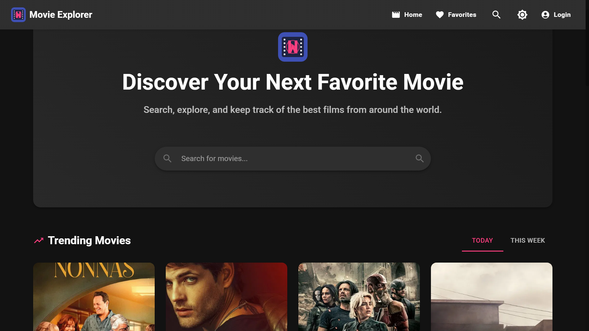

# Movie Explorer App



## 🌐 Live Demo

**[View Live Demo](https://movie-explorer-1qo75atyr-anton-luckshmans-projects.vercel.app)**

Try out the Movie Explorer app with all features fully functional. For demo login, you can use any username with a password of at least 6 characters.

## 🎬 Features

- **User Authentication**: Simple login system with persistent sessions
- **Trending Movies Section**: Display popular movies updated daily/weekly
- **Powerful Search**: Find movies by title, with filtering options
- **Movie Details**: Comprehensive information about each movie
- **YouTube Trailers**: Watch trailers directly in the app
- **Favorites System**: Save and manage your favorite movies
- **Responsive Design**: Works seamlessly on mobile, tablet, and desktop
- **Dark/Light Mode**: Toggle between themes for better viewing experience
- **Filtering Options**: Filter movies by genre, year, and rating

## 🛠️ Technologies Used

- **React**: Frontend library for building the user interface
- **React Router**: Navigation and routing between pages
- **Material UI**: Modern, responsive UI components
- **React Query**: Data fetching, caching, and state management
- **Framer Motion**: Animations and transitions
- **TMDb API**: Movie data source
- **YouTube API**: Embedded trailer playback
- **Local Storage**: Persistent data storage for user preferences and favorites

## 🚀 Getting Started

### Prerequisites

- Node.js (v14 or later)
- npm or yarn
- TMDb API access token (instructions below)

### Installation

1. Clone the repository

   ```bash
   git clone https://github.com/yourusername/movie-explorer.git
   cd movie-explorer
   ```

2. Install dependencies

   ```bash
   npm install
   # or
   yarn install
   ```

3. Create a `.env` file in the root directory with your TMDb API credentials:

   ```
   REACT_APP_TMDB_API_KEY=your_api_key_here
   REACT_APP_TMDB_ACCESS_TOKEN=your_access_token_here
   ```

4. Start the development server

   ```bash
   npm start
   # or
   yarn start
   ```

5. Open `http://localhost:3000` in your browser

## 🔑 TMDb API Setup

This project uses The Movie Database (TMDb) API to fetch movie data:

1. Create an account at [https://www.themoviedb.org/signup](https://www.themoviedb.org/signup)
2. Go to your account settings and navigate to the API section
3. Request an API key (select "Developer" option)
4. After approval, you'll receive an API key and Read Access Token
5. Add both to your `.env` file as shown above

## 📂 Project Structure

```
movie-explorer/
├── public/                  # Static files
├── src/
│   ├── api/                 # API integration
│   │   ├── tmdbDirectApi.js # Direct fetch implementation
│   │   ├── config.js        # API configuration
│   │   └── index.js         # API exports
│   ├── components/          # Reusable components
│   │   ├── ui/              # UI components
│   │   │   ├── MovieCard.jsx
│   │   │   ├── SearchBar.jsx
│   │   │   └── ...
│   │   └── layout/          # Layout components
│   │       └── Layout.jsx
│   ├── context/             # React Context providers
│   │   ├── AuthContext.jsx
│   │   ├── FavoritesContext.jsx
│   │   └── ThemeContext.jsx
│   ├── hooks/               # Custom hooks
│   ├── pages/               # Page components
│   │   ├── Home.jsx
│   │   ├── Search.jsx
│   │   ├── MovieDetails.jsx
│   │   ├── Favorites.jsx
│   │   └── ...
│   ├── styles/              # CSS and style utilities
│   ├── utils/               # Utility functions
│   ├── App.jsx              # Main application component
│   └── index.js             # Application entry point
└── package.json
```

## 🌟 Features Implementation

### Authentication System

The app implements a simple authentication system that:

- Allows users to log in with a username and password
- Stores user data in localStorage for persistence
- Protects the Favorites page, requiring authentication
- Provides user profile information in the navbar

### Movie Data Integration

Movie data is fetched from TMDb API through several endpoints:

- Trending movies (daily/weekly)
- Movie search with filters
- Detailed movie information
- Cast and crew information
- Trailer videos
- Similar movie recommendations

### Responsive UI with Material-UI

The app uses Material-UI components to create a responsive, modern interface:

- Grid-based layout that adapts to different screen sizes
- Card components for displaying movie information
- Dialog components for trailers and additional information
- Custom theme with light/dark mode support

### State Management

The app uses several state management approaches:

- React Context API for global state (authentication, favorites, theme)
- React Query for server state (API data fetching and caching)
- Local component state for UI interactions
- localStorage for persistence between sessions

## 📱 Responsive Design

The app is fully responsive and works on:

- Mobile phones (portrait and landscape)
- Tablets
- Desktop screens of all sizes

It implements a mobile-first approach with specific optimizations for:

- Touch-friendly UI elements
- Appropriate font sizes and spacing
- Optimized layouts for different screen sizes
- Performance considerations for mobile devices

## 🚢 Deployment

The application is deployed on Vercel and accessible at:
[https://movie-explorer-1qo75atyr-anton-luckshmans-projects.vercel.app](https://movie-explorer-1qo75atyr-anton-luckshmans-projects.vercel.app)

### Build for Production

```bash
npm run build
# or
yarn build
```

### Vercel Deployment

This project is configured for seamless deployment on Vercel:

1. Install Vercel CLI (if not already installed)

   ```bash
   npm install -g vercel
   ```

2. Login to Vercel

   ```bash
   vercel login
   ```

3. Deploy the application

   ```bash
   vercel
   ```

4. For production deployment
   ```bash
   vercel --prod
   ```

### Environment Variables on Vercel

For the application to function correctly on Vercel, you need to add the following environment variables in your Vercel project settings:

- `REACT_APP_TMDB_API_KEY`: Your TMDb API key
- `REACT_APP_TMDB_ACCESS_TOKEN`: Your TMDb Read Access Token
- `CI`: Set to `false` to prevent treating warnings as errors during build

## 🔮 Future Improvements

Potential enhancements for the project:

- User registration with backend authentication
- Movie ratings and reviews
- Personalized recommendations
- Advanced filtering and sorting options
- Watchlist functionality
- Social sharing features
- Performance optimizations for larger datasets

## 📝 License

This project is licensed under the MIT License - see the LICENSE file for details.

Created by Anton Luckshman - 2025
